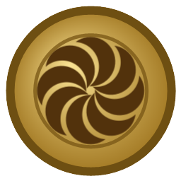

# 🪙 CoinForge Studio

**A challenge-coin, card, token & stamp designer built for laser engraving.**
Design rings of stars, coin-true arc text, motto banners — or a business card, a shaped
pet tag, a rubber stamp die — drop any photo dead-center with local AI background
removal, then export DPI-exact art that lands in your laser software at the right size,
every time.

**[coinforgestudio.com](https://coinforgestudio.com)** · **[Launch the app](https://app.coinforgestudio.com)** · *by **Hratch Simonyan** · MIT License · v1.7.0*



---

## Run it

| Way | How | Notes |
| --- | --- | --- |
| **In your browser** | [app.coinforgestudio.com](https://app.coinforgestudio.com) | Nothing to install; free account (Google sign-in) includes 1 cloud project. Optional [Pro plan](https://coinforgestudio.com/#pricing) adds 10 cloud slots & the template vault |
| **Windows portable** ⭐ | Grab `CoinForgeStudio-Portable.exe` from [Releases](https://github.com/hratchyan/coinforgestudio/releases) | No install, no account, works fully offline — copy it anywhere |
| **Windows installer** | `CoinForgeStudio-Setup.exe` from [Releases](https://github.com/hratchyan/coinforgestudio/releases) | Start-menu & desktop shortcuts |
| **From source** | Clone, then `Launch CoinForge (Browser Mode).bat` | Runs the raw files in Edge/Chrome; zero dependencies |

The desktop app stores projects as `.coin` files in `Documents\CoinForge Projects`
and never phones home — no account, no telemetry, works with no internet at all.

> **First launch of the exe:** it's unsigned (no code-signing certificate yet), so
> Windows SmartScreen may show *"Windows protected your PC"* — click
> **More info → Run anyway**.

## What it does

- **Four kinds of blanks, one engine** — round coins, rectangular **cards & tags**
  (credit-card CR80, business cards, dog tags, key fobs), **shaped tokens** (hexagon,
  octagon, oval, shield, heart, dog bone), and **rubber stamp dies** (round or rect —
  design readable; export mirrors & inverts automatically for a correct raised die).
- **Ring designer** — one-click curated ring presets (star circles, rope, beaded, reeded
  mint edge, military band with knockout stars, text-on-band, laurel wreath, chain…),
  all fully editable: count, radius, size, sweep, density. Round blanks only — cards get
  a rectangular **Frame** element and align-to-blank tools instead.
- **Offline QR codes** — a real QR element (URL, phone, vCard) generated entirely
  locally, scannable straight off the engraving. Works on every blank, coins included.
- **Arc text** engineered like real coinage (top/bottom upright, baseline-true radii,
  justify-across-arc), plus straight text and curved **motto banners** with swallowtails.
- **Symbol library** — 90+ hand-curated vector symbols (eagles, badges, maltese cross,
  fleur-de-lis, anchors, wreaths, skulls, gears…) + hundreds of curated Unicode glyphs.
- **Smart photo import** — paste a screenshot or drop a photo; AI (U²-Net, runs locally,
  nothing uploaded) or classic tools cut the background; the subject auto-crops and lands
  centered on the coin. Full laser prep: grayscale, levels, contrast, gamma, sharpen,
  posterize, circle mask with feather.
- **27 complete templates** — coins (Veteran Eagle, Police, Fire, EMS, Family Crest,
  Wedding, Memorial, Biker, Corporate, Liberty…), cards (contact card, QR business card,
  pet tag), tokens (hex maker token, shield crest, heart keepsake, bone tag) and stamps
  (address block, round company seal, RECEIVED).
- **Layer groups (engraving passes)** — tag elements into color-coded groups, solo/mute
  them, export one perfectly-aligned file per pass, or a color-mapped SVG that laser
  software auto-splits into setting layers.
- **Cut outline generator** — one click traces a smooth vector silhouette around the
  whole design (even when the art has no continuous edge), ready for the cutting layer.
- **Realistic preview** — brass/silver/copper/black blanks, spun finish, relief illusion,
  dark-mark vs light-mark (coated blank) modes. Shade system with knockouts
  (bare-metal text on marked bands, like a minted coin).
- **Export** — PNG at exact DPI (1016 default; pixels map 1:1 to millimetres), optional
  Floyd–Steinberg/Atkinson/ordered/threshold dithering, invert & mirror; SVG with true
  vector paths; `.coin` project files; PNG-to-clipboard.
- **Projects** — thumbnail browser, autosave with crash recovery.
- **Standalone background remover** (Tools menu) for any image, with silhouette/stencil
  mode.
- **Touch-ready** — on phones and tablets the panels become drawers, and the canvas
  gets pinch-zoom and two-finger pan.
- **AI Assistant (MCP), free** — the desktop app can hand its controls to your own AI
  (Claude Desktop, Claude Code, or any MCP client), which designs coins, cards, tokens
  and stamps in your window while you watch — real elements, real previews, laser-ready
  export. Tools → AI Assistant.

## Documentation

Press **F1** in the app, or read the same manuals here:

- [User Guide](docs/USER_GUIDE.md) — every panel and tool
- [Laser Workflow](docs/LASER_WORKFLOW.md) — design → fiber laser: focus, test grids, deep engraving, coated blanks, troubleshooting
- [Keyboard Shortcuts](docs/SHORTCUTS.md)
- [FAQ](docs/FAQ.md)
- [Customizing](docs/CUSTOMIZING.md) — add your own symbols, ring presets, templates, fonts, and metals (it's all plain JavaScript data files)

## Folder map

```
coinforgestudio/
├─ app/                           ← the entire application (plain web tech, no build step)
│  ├─ index.html · css/ · js/     ← source, deliberately unminified & hackable
│  ├─ assets/fonts/               ← 10 bundled OFL font families
│  ├─ assets/models/u2netp.onnx   ← local AI background-removal model
│  └─ vendor/                     ← onnxruntime-web (wasm) + Firebase SDK (hosted gate)
├─ site/                          ← coinforgestudio.com landing page
├─ docs/                          ← manuals (also embedded in-app)
├─ electron/                      ← desktop wrapper (main + preload)
├─ tools/                         ← dev server, doc embedder, icon/video generators
└─ build/icon.ico
```

## Build from source

No build needed to *run* (browser mode runs the raw files). To rebuild the desktop exe:

```
# any Node.js >= 18
npm install
npm run dist        # → dist/CoinForgeStudio-Portable.exe + CoinForgeStudio-Setup.exe
```

Other scripts: `npm start` (dev app), `npm run serve` (browser dev server),
`npm run docs` (re-embed the manuals after editing /docs).

## Support the project

CoinForge is free forever — no ads, no tracking, no paywalls. If it saved you an
evening, a coffee keeps the forge hot: **[ko-fi.com/hratchyan](https://ko-fi.com/hratchyan)** ☕
A GitHub star helps other makers find it, and that's worth just as much.

## Credits

- Designed and directed by **Hratch Simonyan**; engineered end-to-end in an extended
  pair-programming collaboration with **Claude Fable 5** (Anthropic) — from the first
  line of the geometry engine to the landing page you found this on.
- Fonts: Cinzel, Cinzel Decorative, EB Garamond, Bebas Neue, Oswald, Black Ops One,
  Great Vibes, Pirata One, Rye, Special Elite — Google Fonts, SIL Open Font License
- AI model: [U²-Net](https://github.com/xuebinqin/U-2-Net) (u2netp) — Apache-2.0
- Runtime: [onnxruntime-web](https://onnxruntime.ai) — MIT · Desktop shell: Electron — MIT

---

*Made for makers. Measure twice, engrave once.* — **Hratch Simonyan**